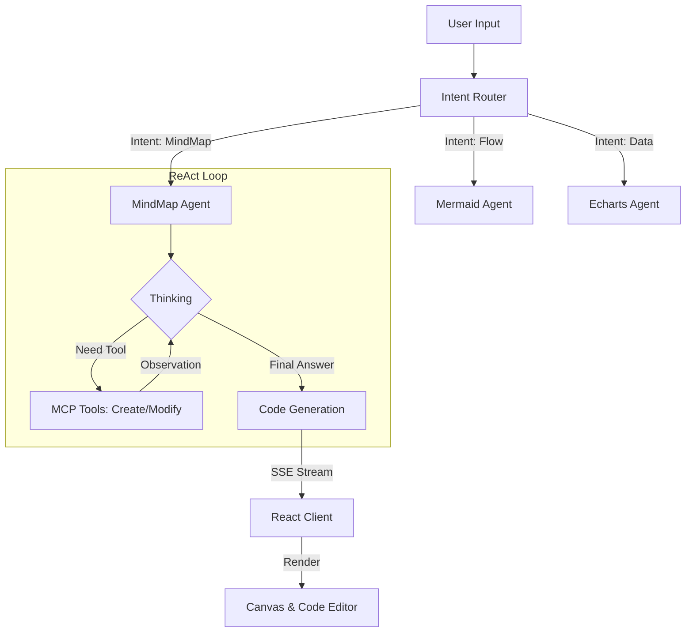

# 📝 DeepDiagram 产品需求文档 (PRD)

| 版本 | 日期 | 状态 | 作者 | 备注 |
| :--- | :--- | :--- | :--- | :--- |
| v1.0 | 2025-12-09 | Draft | DeepDiagram Team | 初始架构设计：ReAct Agents + MCP 工具化 |

## 1\. 项目概述 (Product Overview)

**DeepDiagram** 是一款开源的智能可视化平台。它打破了传统“拖拽式”绘图的局限，采用 **Agentic AI (代理智能)** 架构。每个核心绘图功能（思维导图、流程图、数据图表）都由一个独立的 **AI Agent** 负责。

用户通过自然语言与 Agent 交互，Agent 具备 **"Create (从零创建)"** 和 **"Modify (基于上下文修改)"** 的能力，利用 ReAct 模式进行思考与决策，并通过流式响应（Streaming）实时反馈绘图过程。

-----

## 2\. 系统架构 (System Architecture)

系统采用 **前后端分离** 架构，核心亮点在于后端的 **LangGraph 多智能体编排** 和前端的 **SSE 流式渲染**。

### 2.1 技术栈选型

  * **Frontend:** React 18, Vite, TypeScript, TailwindCSS, Zustand (State Management).
  * **Backend:** Python 3.10+, FastAPI (Async Web Framework).
  * **AI Orchestration:** LangGraph (Stateful Agents), LangChain.
  * **Protocol:** Model Context Protocol (MCP) 思想用于工具定义.
  * **Rendering Engines:**
      * MindMap: `markmap-lib`
      * Flow: `mermaid.js`
      * Charts: `apache-echarts`

### 2.2 核心流程图



-----

## 3\. 功能模块详解 (Functional Modules)

### 3.1 核心 Agent 定义

每个模块都是一个 Agent，拥有独立的 Prompt 和 Tool Set。

#### 🧑‍🎨 Agent A: 思维导图专家 (MindMapper)

  * **场景:** 读书笔记、大纲整理、头脑风暴。
  * **输入:** 长文本、主题关键词。
  * **输出格式:** Markdown (用于 Markmap 渲染)。
  * **MCP 工具集:**
      * `create_mindmap(topic, content)`: 根据内容生成 Markdown 结构。
      * `modify_mindmap(instruction, current_markdown)`: 基于现有的 Markdown 进行增删改。

#### 🧜‍♂️ Agent B: 流程架构师 (FlowArchitect)

  * **场景:** 时序图、流程图、类图、甘特图。
  * **输入:** 业务逻辑描述、代码片段。
  * **输出格式:** Mermaid Syntax Code。
  * **MCP 工具集:**
      * `create_flow(type, description)`: 生成指定类型 (e.g., sequence, graph TD) 的代码。
      * `modify_flow(instruction, current_code)`: 修正节点关系、样式或标签。

#### 📊 Agent C: 数据分析师 (DataVisualizer)

  * **场景:** 销售报表、数据趋势分析。
  * **输入:** CSV 数据、JSON 数据、自然语言数据描述。
  * **输出格式:** Echarts Option (JSON Object)。
  * **MCP 工具集:**
      * `create_chart(data, chart_type)`: 生成标准 Echarts Option。
      * `modify_chart(instruction, current_option)`: 修改图表配置（如颜色、图例、数据过滤）。

-----

## 4\. 交互与接口设计 (Interaction & API)

### 4.1 流式通信协议 (SSE Protocol)

为了实现“所见即所得”和“能够看到 AI 思考”，接口采用 Server-Sent Events (SSE)。

**Endpoint:** `POST /api/chat/stream`

**Payload:**

```json
{
  "agent_id": "echarts_agent",
  "prompt": "把柱状图改成红色的",
  "history": [...],
  "context": {
    "current_code": "{...}" // 当前画布上的代码，用于 Modify 操作
  }
}
```

**Stream Events:**

| Event Type | Description | Client Action |
| :--- | :--- | :--- |
| `thought` | AI 的内心独白 (ReAct Thought) | 在聊天气泡中显示折叠的“思考过程” |
| `tool_start` | AI 开始调用工具 | 显示 Loading 状态：“正在调用 create\_chart...” |
| `tool_end` | 工具调用完成 | 显示：“工具调用成功” |
| `code_chunk` | 最终生成的代码片段 | 实时拼接并更新 Monaco Editor |
| `error` | 发生错误 | 弹窗提示并允许重试 |

### 4.2 前端界面布局 (UI Layout)

采用 **左右分栏** 布局，强调“对话”与“画布”的联动。

  * **Left Panel (Chat):**
      * 对话流：用户消息 + AI 消息（包含思考过程）。
      * 输入框：支持文本输入、文件上传（CSV/MD/TXT）。
      * 模式切换：Tab 栏切换当前激活的 Agent (MindMap / Mermaid / Echarts)。
  * **Right Panel (Canvas):**
      * **Toolbar:** 复制代码、下载图片 (PNG/SVG)、全屏。
      * **View Switcher:** “预览模式 (Preview)” / “代码模式 (Code)”。
      * **Preview Area:** 渲染 Markmap / Mermaid / Echarts 组件。
      * **Code Editor:** 集成 Monaco Editor，支持代码高亮。**关键交互：** 用户手动修改代码后，将新代码存入 State，下次对话时回传给后端，保证 AI 基于最新代码修改。

-----

## 5\. 核心业务逻辑 (Agentic Workflow)

### 场景：用户修改图表

1.  **Context Injection:** 前端将编辑器中当前的 `option` 代码作为 `current_code` 放入请求体。
2.  **LLM Thinking:** 后端 Agent 接收请求。
      * *Thought:* "用户想要修改颜色。我应该查看 `current_code`，找到 `itemStyle` 字段，并调用 `modify_chart` 工具。"
3.  **Tool Execution:**
      * `modify_chart` 工具执行。输入：旧 JSON，修改指令。
      * 工具内部逻辑（或子 LLM）执行具体的 JSON Patch 操作。
4.  **Response:** 生成新的 JSON 代码。
5.  **Rendering:** 前端接收新代码，Echarts 组件重绘。

-----

## 6\. 开发计划 (Roadmap)

### Phase 1: MVP (最小可行性产品)

  * [ ] 搭建 FastAPI + LangGraph 基础框架。
  * [ ] 实现三大 Agent 的 `Create` 工具（只支持从头生成）。
  * [ ] 前端实现 SSE 解析与基础渲染。
  * [ ] 部署 demo 验证 LangGraph 的路由逻辑。

### Phase 2: Refinement (交互与修改能力)

  * [ ] 实现 `Modify` 工具链：在 Prompt 中注入 `current_code` 上下文。
  * [ ] 集成 Monaco Editor，实现双向绑定（AI 改代码 -\> 图变；人改代码 -\> 图变 -\> AI 知道）。
  * [ ] 优化流式输出体验，减少等待焦虑。

### Phase 3: Integration (综合报告)

  * [ ] 增加 **Report Agent**：能够读取 PDF/Word，自动规划，调用上述三个 Agent 分别生成图表，最后组合成一篇 HTML 报告。
  * [ ] 支持导出为 PPT/PDF。

-----

## 7\. 附录：Prompt 设计示例 (System Prompt)

**Echarts Agent System Prompt:**

```text
You are an expert Data Visualization Assistant specialized in Apache Echarts.
You have access to tools to create and modify charts.

RULES:
1. Always analyze the user's intent first.
2. If the user wants to create a new chart, call 'create_chart'.
3. If the user refers to the existing chart (e.g., "change color to red", "add a title"), call 'modify_chart'.
4. When calling 'modify_chart', you MUST rely on the 'current_code' provided in the context.
5. Output strict JSON when generating code. No markdown wrapper outside the specific tool output.
```