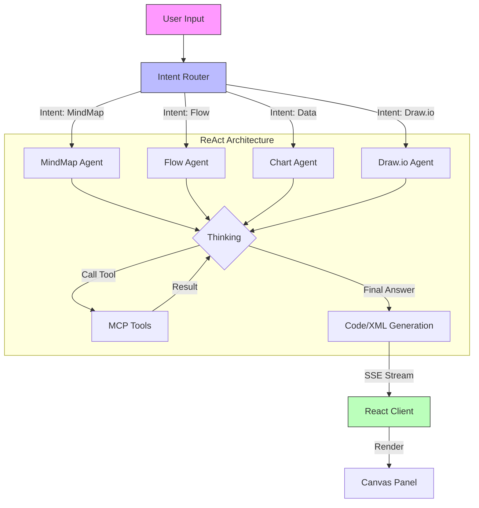

# DeepDiagram: Agentic AI Visualization Platform

**DeepDiagram** is an open-source, intelligent visualization platform that leverages **Agentic AI** to transform natural language into professional diagrams. Unlike traditional drag-and-drop tools, DeepDiagram employs a multi-agent architecture where specialized agents handle different visualization domains—from mind maps to complex data charts.

---

## 🚀 Features

### 🧠 Mind Map Agent
- **Powered by**: `markmap-lib`
- **Capabilities**: Generates structured mind maps for brainstorming, note-taking, and outlining.
- **Workflow**: Converts text summaries and hierarchical data into interactive Markdown-based maps.

### 🧜‍♂️ Flowchart Agent
- **Powered by**: `mermaid.js`
- **Capabilities**: Creates detailed flowcharts, sequence diagrams, Gantt charts, and class diagrams.
- **Workflow**: Translates logic and process descriptions into valid Mermaid syntax.

### 📊 Data Chart Agent
- **Powered by**: `apache-echarts`
- **Capabilities**: Visualizes data using bar charts, line graphs, pie charts, and more.
- **Workflow**: Analyzes CSV/JSON data or descriptions to generate Echarts configurations.

### ✏️ Draw.io Agent
- **Powered by**: `mxGraph` (Draw.io)
- **Capabilities**: Produces professional-grade technical diagrams compatible with the Draw.io ecosystem.
- **Workflow**: Generates valid XML for seamless integration and editing.

---

## 🏗 System Architecture

DeepDiagram uses a **React + FastAPI** architecture, orchestrated by **LangGraph**. The system routs user intents to specific agents, which use **MCP (Model Context Protocol)** style tools to generate or modify content. Updates are streamed to the frontend via **SSE (Server-Sent Events)** for a "Think-while-drawing" experience.



---

## 🛠 Tech Stack

- **Frontend**: React 18, Vite, TypeScript, TailwindCSS, Zustand
- **Backend**: Python 3.10+, FastAPI, LangGraph, LangChain
- **Package Manager**: `uv` (Python), `npm` (Node.js)

---

## 🏁 Getting Started

### Prerequisites
- **Python**: 3.10 or higher
- **Node.js**: v18 or higher
- **uv**: An extremely fast Python package installer and resolver (`pip install uv`).

### 1. Backend Setup

The backend handles AI orchestration and API services.

```bash
cd backend

# Create virtual environment and install dependencies
uv sync

# Activate the virtual environment
source .venv/bin/activate

# Start the server (runs on http://localhost:8000)
bash start_backend.sh
```

### 2. Frontend Setup

The frontend provides the chat interface and diagram rendering canvas.

```bash
cd frontend

# Install dependencies
npm install

# Start the development server
npm run dev
```

Visit `http://localhost:5173` (or the port shown in your terminal) to start using DeepDiagram.

---

## 📖 Usage Guide

1.  **Select an Agent**: Use the tabs in the chat panel to switch between MindMap, Flow, Chart, or Draw.io modes.
2.  **Describe Your Request**:
    -   *MindMap*: "Create a mind map for a marketing strategy."
    -   *Flow*: "Draw a login sequence diagram."
    -   *Chart*: "Show a bar chart of sales data: Q1 100, Q2 150..."
3.  **Refine**: You can ask the agent to modify the result (e.g., "Change the chart color to red").
4.  **Export**: Use the toolbar to copy code or download images.

---

## 🗺 Roadmap

- [x] MVP with 3 Core Agents (MindMap, Flow, Charts)
- [x] Draw.io Integration
- [ ] Collaborative Editing
- [ ] Export to PDF/PPT
- [ ] "Report Agent" for comprehensive document generation
